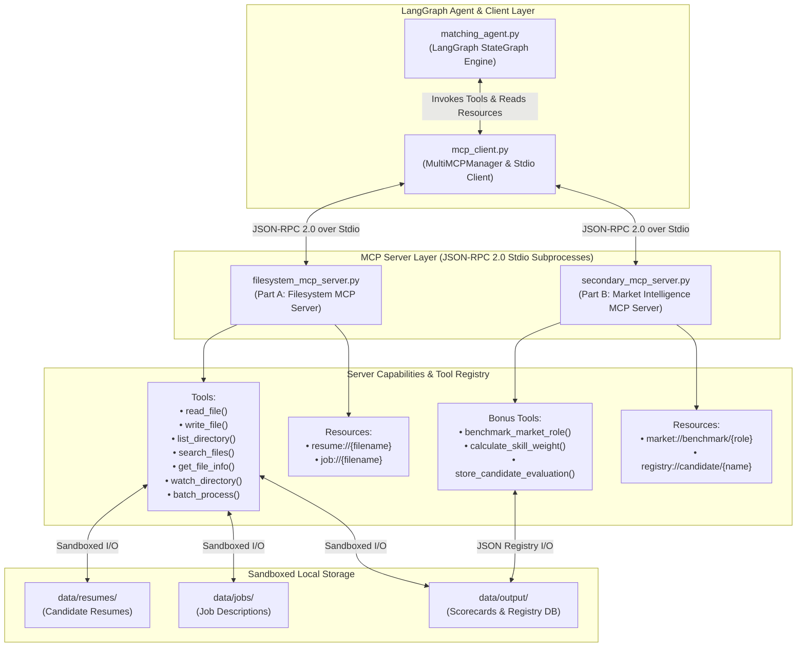
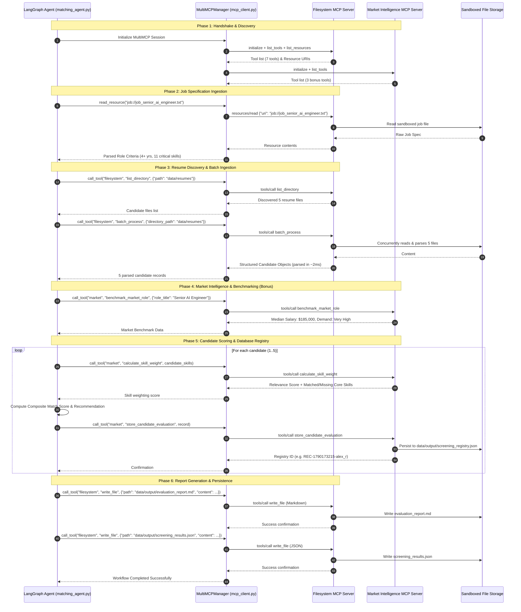

# System Architecture & Protocol Specification

This document details the architectural design, protocol specifications, security sandboxing, and state machine interactions for the **Model Context Protocol (MCP) Integration** project.

---

## 1. High-Level System Architecture

The system decouples agentic reasoning from file system operations and market intelligence by introducing **Model Context Protocol (MCP)** servers communicating over standardized JSON-RPC 2.0 via `stdio` transport.



---

## 2. State Machine & Agent ↔ MCP Workflow

The LangGraph agent is orchestrated as a directed acyclic state graph (`StateGraph(MatchingState)`). Every single data read, parse, query, and write operation is executed through MCP client tool/resource calls.



---

## 3. Protocol Specifications: JSON-RPC 2.0

All communication follows the Anthropic Model Context Protocol specification over stdio.

### 3.1 Tool Call Example: `batch_process`

**Request:**
```json
{
  "jsonrpc": "2.0",
  "id": 1,
  "method": "tools/call",
  "params": {
    "name": "batch_process",
    "arguments": {
      "directory_path": "data/resumes",
      "action": "parse_resume"
    }
  }
}
```

**Response:**
```json
{
  "jsonrpc": "2.0",
  "id": 1,
  "result": {
    "content": [
      {
        "type": "text",
        "text": "{\"status\":\"success\",\"total_files\":5,\"processed_count\":5,\"duration_ms\":3.62,\"results\":[...]}"
      }
    ],
    "isError": false
  }
}
```

### 3.2 Resource Read Example: `job://job_senior_ai_engineer.txt`

**Request:**
```json
{
  "jsonrpc": "2.0",
  "id": 2,
  "method": "resources/read",
  "params": {
    "uri": "job://job_senior_ai_engineer.txt"
  }
}
```

**Response:**
```json
{
  "jsonrpc": "2.0",
  "id": 2,
  "result": {
    "contents": [
      {
        "uri": "job://job_senior_ai_engineer.txt",
        "mimeType": "text/plain",
        "text": "Job Title: Senior AI / Agent Systems Engineer\n..."
      }
    ]
  }
}
```

---

## 4. Security Sandboxing Model

The Filesystem MCP Server implements strict boundary validation:
1. **Root Enclosure**: All paths passed to any tool or resource are resolved via `sanitize_path()`.
2. **Path Traversal Defense**: The resolved path must be relative to `SANDBOX_ROOT`. If a path contains `../` attempting to escape the project workspace, a `PermissionError` is thrown and mapped to an MCP tool error.
3. **Extension Whitelist**: Only allowed formats (`.txt`, `.md`, `.json`, `.pdf`, `.csv`) are processed.
4. **File Size Limits**: File size threshold prevents denial-of-service / memory exhaustion.
